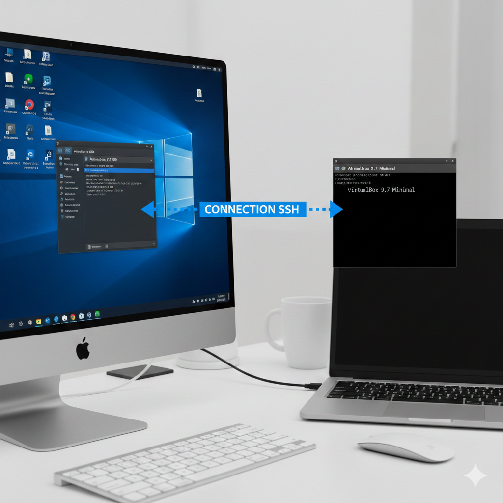

# Docker-arcueil
Docker training course  

## See hosts topology


## Premieres commandes pour l'OS almalinux 9.7
```shell
hostnamectl
sudo dnf -y update
sudo dnf install -y epel-release
sudo dnf install -y git wget htop iotop iftop vim
```
## Install docker en mode prod 
See docker-in-prod/README.md


